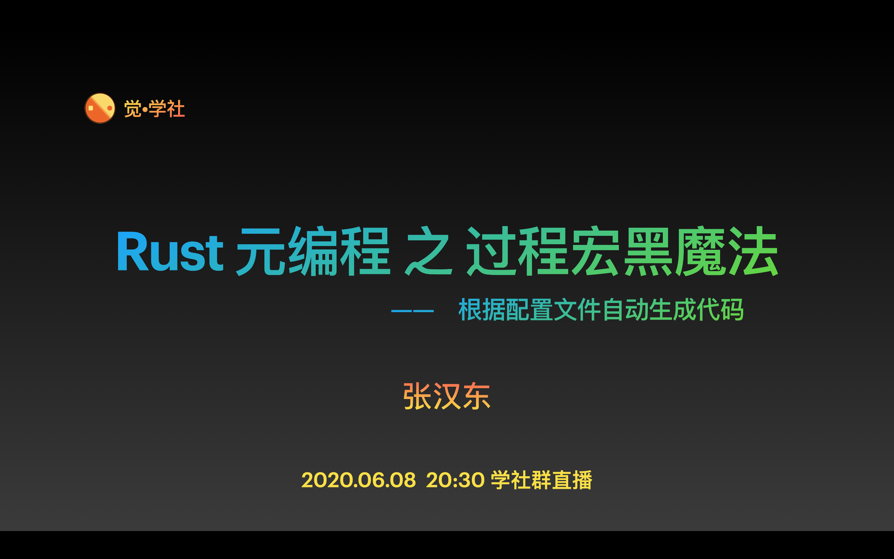
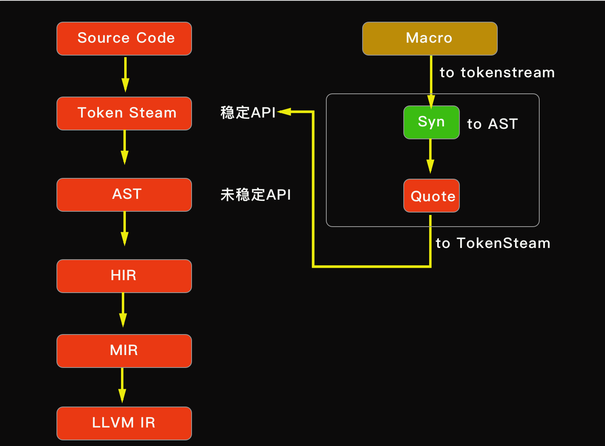

# 过程宏：根据配置文件自动生成代码

[如何加入「觉•学社」？](https://zhuanlan.zhihu.com/p/59517478)

#### 一、 宏的工作原理介绍

### 二、 相关库介绍：syn 和 quote

- [syn]() 用于生成AST
- [quote]() 用于生成TokenStream
- [proc-macro2]() TokenStream API接口

### 三、 根据配置文件生成代码代码实现

### 小结：

1. 宏自动迭代生成的字段、参数默认是字典序排列
2. 宏在编译时不会对生成代码进行类型检查，所以需要小心

### 扩展练习：

1. 处理各种边界条件判断
2. 支持结构体类型判断，当前只支持具名结构体，扩展为支持三种类型结构体。
3. 可以指定配置文件路径
4. 自由发挥